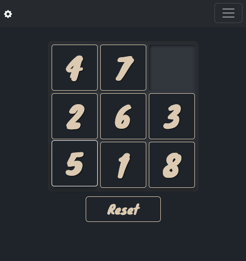
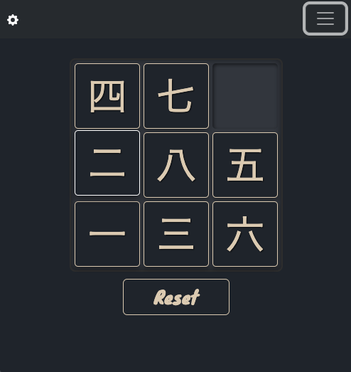

# Sliding Puzzle

A classic, customizable sliding puzzle game built with modern vanilla JavaScript, HTML, and CSS. 





## ✨ Features

*   **Customizable Content:** Play with standard Arabic numbers or traditional Japanese numerals.
*   **Configurable Grid Size:** Easily change the puzzle's dimensions (e.g., 3x3, 4x4) via CSS custom properties.
*   **Smooth Animations:** Tiles slide into place with fluid CSS transitions, powered by JavaScript calculations.
*   **Stateful UI:** A settings panel allows for runtime changes to the game type, with confirmation dialogs to prevent losing progress.
*   **Robust State Management:** A clear separation of concerns for managing game state, UI, and user interactions.
*   **Themable:** The entire look and feel can be changed by modifying a few CSS custom properties.

## 🚀 Tech Stack & Key Concepts

This project is built with **vanilla JavaScript (ES6+)**, HTML5, and CSS3, with no external frameworks for the core logic. It leverages [Bootstrap 5](https://getbootstrap.com/) for some UI components like the settings panel and alerts.

The codebase serves as a practical example for several advanced JavaScript concepts:

*   **DOM Manipulation & Animation:**
    *   Using `getBoundingClientRect()` for precise animation calculations.
    *   Leveraging `requestAnimationFrame()` for smooth, glitch-free rendering cycles.
*   **Modern JavaScript Features:**
    *   Asynchronous operations with `async/await` and `Promises`.
    *   Advanced object destructuring with default values and computed property names for flexible and maintainable functions.
*   **Code Architecture:**
    *   A modular structure separating concerns into controllers, services, utilities, and components.
    *   Event delegation for efficient event handling on the puzzle board.

## 🎮 How to Play

1.  Open `index.html` in your web browser.
2.  Click on a tile adjacent to the empty space to slide it.
3.  Arrange the tiles in sequential order (1, 2, 3... or 一, 二, 三...) with the empty space in the last position to win.
4.  Click the **Settings** button (gear icon) to change the tile content type.
5.  Click the **Reset** button to start a new game.

## 📂 Project Structure

The project is organized to promote maintainability and separation of concerns:

```
/
├── src/
│   ├── js/
│   │   ├── components/       # Handles user interactions and UI logic.
│   │   ├── constants/        # Application-wide constants (CSS classes, state keys).
│   │   ├── controllers/      # Manages specific UI components like alerts.
│   │   ├── services/         # Manages global state and DOM element selection.
│   │   └── utils/            # Helper functions for animation, board logic, etc.
│   ├── css/                  # All custom styles and theming variables.
│   └── lib/                  # Third-party libraries (Bootstrap).
├── docs/                     # Detailed explanations of key concepts.
└── index.html                # The main entry point of the application.
```

## 🎓 Learning Topics

This repository includes detailed documents explaining some of the core JavaScript concepts used. They are a great resource for understanding *why* the code is written the way it is.

*   **LT01: Understanding `getBoundingClientRect()`** - How to get precise element positions for animations.
*   **LT02: Understanding `requestAnimationFrame()`** - How to create smooth, efficient animations.
*   **LT03: Destructuring with Default Values** - Writing robust functions that handle missing arguments.
*   **LT04: Computed Property Destructuring** - A powerful pattern for creating maintainable, key-based logic.
